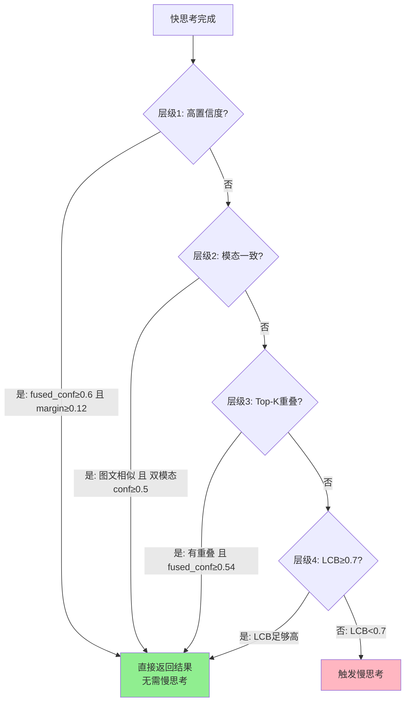

# 快慢思考触发器机制详解

## 📖 概述

本文档详细记录了快慢思考系统中**快思考如何判断是否需要进入慢思考**的完整逻辑，包括：
- 🔍 **触发器判断流程**：多层级规则判断机制
- 📐 **数学公式详解**：所有计算公式的推导和实现
- 🧮 **LCB算法原理**：基于UCB理论的动态阈值计算
- 🤖 **MLLM增强判断**：多模态大模型的智能决策层
- 📊 **实现细节索引**：精确到代码行号的实现位置

**核心问题**：快思考在什么情况下会触发慢思考？

**答案**：通过**四层级规则判断 + LCB动态评估**，或者使用**MLLM智能判断**来决定。

## 🔄 快慢思考调度逻辑全解析

### 1. 原有快慢思考调度逻辑（基于规则的多层级触发）

#### 1.1 触发机制总体流程

```
快思考执行 → 四层级规则判断 → LCB动态评估 → 是否触发慢思考
```

**核心实现位置：** `fast_thinking.py` 第289-341行 `trigger_lcb()` 方法

#### 1.2 快思考进入慢思考的完整判断流程



**判断逻辑说明**：
1. **层级1-3**：基于快思考结果的置信度、模态一致性和Top-K重叠进行快速判断
2. **层级4**：使用LCB算法综合历史表现和当前不确定性进行动态评估
3. **只要任一层级满足条件**：直接返回结果，无需慢思考
4. **所有层级都不满足**：触发慢思考进行深度分析

#### 1.2 四层级判断机制详解

| 层级 | 判断条件 | 代码位置 | 阈值设置 | 判断逻辑 |
|------|----------|----------|----------|----------|
| **层级1** | 高置信度快速返回 | `fast_thinking.py:309-310` | `fused_conf_threshold=0.6`<br>`fused_margin_threshold=0.12` | 融合置信度≥0.6 **且** 边际差异≥0.12 |
| **层级2** | 模态一致性检查 | `fast_thinking.py:313-314` | `similarity_threshold=0.7`<br>`per_modality_conf_threshold=0.5` | 图文类别相似≥0.7 **且** 双模态置信度≥0.5 |
| **层级3** | Top-K重叠验证 | `fast_thinking.py:317-318` | `fused_conf_threshold * 0.9=0.54` | Top-K有重叠 **且** 融合置信度≥0.54 |
| **层级4** | LCB动态阈值 | `fast_thinking.py:334-337` | `lcb_threshold=0.7` | 基于UCB理论的Lower Confidence Bound≥0.7 |

#### 1.3 原有触发机制特点

**优势：**
- ✅ **多层保护**：4个层级逐级筛选，减少误判
- ✅ **参数化控制**：所有阈值可配置，便于调优
- ✅ **理论支撑**：LCB基于UCB理论，有数学基础
- ✅ **计算高效**：纯数值计算，无额外模型调用

**局限性：**
- ❌ **缺乏语义理解**：仅基于数值特征，无法理解图像内容
- ❌ **固定阈值**：预设参数可能不适用所有场景
- ❌ **模态割裂**：分别处理图文信息，缺乏深度融合判断
- ❌ **边界case敏感**：在阈值边界容易产生不稳定判断

#### 1.4 LCB算法核心详解（第343-395行）

**LCB (Lower Confidence Bound)** 是基于UCB理论的动态置信度评估算法，综合考虑历史表现和当前不确定性。

##### 1.4.1 LCB计算公式

```
LCB = p̂ - confidence_term - α × H
```

其中：
- **p̂**: Beta先验平滑后的历史准确率估计
- **confidence_term**: 统计置信区间项（基于UCB理论）
- **α**: 熵权重系数（默认0.5）
- **H**: 归一化熵（反映当前预测的不确定性）

##### 1.4.2 各项计算详解

**1) Beta先验平滑（解决冷启动问题）**
```python
n = n_raw + prior_strength          # 历史预测次数 + 先验强度(2.0)
m = m_raw + prior_p × prior_strength # 历史正确次数 + 先验正确率(0.6) × 先验强度
p̂ = m / (n + ε)                     # 平滑后的准确率估计
```

**2) 置信度分布熵（反映模型犹豫程度）**
```python
# 输入: confidence_scores = [img_confidence, text_confidence, fused_top1_prob]
probs = confidence_scores / sum(confidence_scores)  # 归一化为概率分布
H = -Σ(p_i × log(p_i)) / log(len(probs))          # 归一化熵 ∈ [0,1]
```

**3) 置信区间项（基于UCB理论）**
```python
if n_raw > 0:
    confidence_term = η × sqrt(log(total_predictions) / (2×n + 1))
else:  # 冷启动情况
    confidence_term = η × sqrt(log(total_predictions))
```

其中 η (lcb_eta) 默认为1.0

##### 1.4.3 LCB判断逻辑

```python
if LCB ≥ 0.7:
    return False  # 无需慢思考，直接返回结果
else:
    return True   # 触发慢思考
```

**物理意义**：
- **LCB高（≥0.7）**：该类别历史表现好且当前确定性高 → 可信，无需慢思考
- **LCB低（<0.7）**：历史表现差或当前不确定性高 → 不可信，需要慢思考

**代码实现**：`fast_thinking.py` 第343-383行

### 2. 新增MLLM中间判断优化逻辑

#### 2.1 三种触发模式架构

**核心实现位置：** `fast_slow_thinking_system.py` 第297-314行 `classify_single_image()` 方法

```python
if use_slow_thinking is not None:
    # 模式1: 强制指定（实验控制）
elif self.enable_mllm_intermediate_judge:
    # 模式2: MLLM中间判断（新增优化）
else:
    # 模式3: 传统规则判断（原有逻辑）
```

#### 2.2 MLLM中间判断详细流程

| 步骤 | 功能 | 代码位置 | 核心逻辑 |
|------|------|----------|----------|
| **输入准备** | 获取快思考Top-K结果 | `fast_slow_thinking_system.py:182-193` | 提取融合排序结果 |
| **提示构造** | 构建MLLM分析提示 | `fast_slow_thinking_system.py:194-208` | 结构化候选类别列表 |
| **模型调用** | MLLM视觉分析 | `fast_slow_thinking_system.py:210-213` | `text_image_response_multimodal()` |
| **响应解析** | 提取决策和置信度 | `fast_slow_thinking_system.py:220-265` | 解析"有信心/没信心" + 数值 |
| **双重判断** | 文本决策 + 数值阈值 | `fast_slow_thinking_system.py:256` | `decision_confident AND confidence≥0.6` |

#### 2.3 MLLM判断核心逻辑

**双重置信度评估机制：**

```python
# 条件1: 主观文本决策
decision_confident = '有信心' in mllm_response

# 条件2: 客观数值置信度  
confidence >= 0.6

# 最终决策: 两个条件都满足才跳过慢思考
need_slow_thinking = not (decision_confident and confidence >= 0.6)
```

**代码位置：** `fast_slow_thinking_system.py` 第256行

## 📊 原有 vs 优化 对比分析表

### 3.1 触发机制对比

| 维度 | 原有规则触发 | MLLM中间判断 | 改进效果 |
|------|-------------|-------------|----------|
| **判断依据** | 数值阈值 + 统计特征 | 视觉内容 + 语义理解 | ✅ 从统计到语义 |
| **适应性** | 固定参数，场景适应弱 | 动态判断，场景自适应 | ✅ 自适应能力↑ |
| **可解释性** | 规则透明，但缺乏语义 | MLLM提供推理过程 | ✅ 语义可解释性↑ |
| **计算开销** | 纯数值计算（~1ms） | MLLM推理（~500ms） | ❌ 计算开销↑ |
| **准确性** | 依赖特征工程 | 利用模型视觉能力 | ✅ 预期准确性↑ |
| **边界稳定性** | 阈值边界敏感 | 模型连续判断 | ✅ 边界稳定性↑ |

### 3.2 参数配置对比

| 参数类型 | 原有触发机制 | MLLM优化机制 | 调优难度 |
|---------|-------------|-------------|---------|
| **融合置信度阈值** | `fused_conf_threshold=0.6` | - | 需要数据驱动调优 |
| **边际差异阈值** | `fused_margin_threshold=0.12` | - | 需要数据驱动调优 |
| **模态置信度阈值** | `per_modality_conf_threshold=0.5` | - | 需要数据驱动调优 |
| **LCB阈值** | `lcb_threshold=0.7` | - | 需要理论+实验调优 |
| **MLLM置信度阈值** | - | `mllm_confidence_threshold=0.6` | 相对容易调优 |
| **开关控制** | - | `enable_mllm_intermediate_judge` | 一键切换 |

### 3.3 性能指标预期对比

| 指标 | 原有触发 | MLLM优化 | 变化趋势 |
|------|---------|---------|---------|
| **慢思考触发率** | 基线值 | 预期降低10-20% | ⬇️ 更精准触发 |
| **分类准确率** | 基线值 | 预期提升2-5% | ⬆️ 减少误判 |
| **平均推理时间** | 基线值 | 增加~500ms | ⬆️ MLLM判断开销 |
| **边界case处理** | 不稳定 | 更稳定 | ⬆️ 减少抖动 |
| **复杂场景适应** | 较弱 | 较强 | ⬆️ 语义理解优势 |

## 🔧 实现架构详解

### 4.1 代码调用链路图

```
discovering.py (入口)
└── FastSlowThinkingSystem.classify_single_image()  [297-314行]
    ├── 强制模式: use_slow_thinking != None
    ├── MLLM模式: self.mllm_intermediate_judge()     [154-218行]
    └── 传统模式: fast_result["need_slow_thinking"]
                   └── FastThinking.trigger_lcb()    [289-341行]
                       └── calculate_lcb()           [343-395行]
```

### 4.2 关键文件和行号索引

| 功能模块 | 文件位置 | 关键方法 | 行号范围 |
|---------|----------|----------|----------|
| **MLLM触发控制** | `fast_slow_thinking_system.py` | `classify_single_image()` | 297-314 |
| **MLLM中间判断** | `fast_slow_thinking_system.py` | `mllm_intermediate_judge()` | 154-218 |
| **MLLM响应解析** | `fast_slow_thinking_system.py` | `_parse_mllm_judge_response()` | 220-265 |
| **传统触发机制** | `fast_thinking.py` | `trigger_lcb()` | 289-341 |
| **LCB算法实现** | `fast_thinking.py` | `calculate_lcb()` | 343-395 |
| **快思考主流程** | `fast_thinking.py` | `fast_thinking_pipeline()` | 469-471 |
| **参数配置** | `discovering.py` | 命令行参数 | 374 |

### 4.3 控制开关使用方法

**启用MLLM中间判断：**
```bash
python discovering.py --mode=fast_slow --enable_mllm_intermediate_judge
```

**传统模式（默认）：**
```bash  
python discovering.py --mode=fast_slow
```

**对应代码位置：** `discovering.py` 第374行参数定义

## 💡 MLLM中间判断实现详解

### 5.1 提示词设计

**核心提示模板：** `fast_slow_thinking_system.py` 第194-208行

```python
prompt = f"""你是一个专业的图像分类专家。请分析这张图像和以下候选分类结果，
判断你是否有足够的信心做出最终分类决定。

候选类别（按相似度排序）：
{candidates_text}

请按以下格式回答：
决策：[有信心/没信心]
预测类别：[类别名称]  
置信度：[0-1的数值]
推理：[简要说明你的判断理由]"""
```

### 5.2 响应解析机制

**解析逻辑：** `fast_slow_thinking_system.py` 第220-265行

| 解析字段 | 匹配模式 | 默认值 | 作用 |
|---------|----------|---------|------|
| **决策判断** | `'有信心' in response` | `False` | 主观置信度评估 |
| **预测类别** | `"预测类别：" + 类别名` | `fused_results[0][0]` | 兜底预测结果 |
| **数值置信度** | `"置信度：" + 浮点数` | `0.5` | 客观量化指标 |

### 5.3 双重置信度评估机制

```python
# fast_slow_thinking_system.py 第256行
need_slow_thinking = not (decision_confident and confidence >= 0.6)
```

**逻辑表：**

| 文本决策 | 数值置信度 | 最终判断 | 触发慢思考 |
|---------|-----------|----------|----------|
| 有信心 | ≥ 0.6 | 高置信度 | ❌ 否 |
| 有信心 | < 0.6 | 中等置信度 | ✅ 是 |
| 没信心 | ≥ 0.6 | 主观不确定 | ✅ 是 |
| 没信心 | < 0.6 | 低置信度 | ✅ 是 |

## 🎯 优化效果分析

### 6.1 MLLM判断优势

| 优势维度 | 具体表现 | 相比原有机制 |
|---------|----------|-------------|
| **语义理解** | 基于视觉内容理解图像细节特征 | 🆚 仅数值特征分析 |
| **场景适应** | 识别遮挡、模糊、变形等复杂情况 | 🆚 固定阈值敏感 |
| **推理透明** | 提供判断理由和推理过程 | 🆚 黑盒数值计算 |
| **动态调整** | 根据图像内容动态调整判断标准 | 🆚 预设参数配置 |

### 6.2 潜在风险与缓解

| 风险 | 影响 | 缓解措施 | 代码位置 |
|------|------|----------|----------|
| **MLLM调用失败** | 系统异常 | 容错机制，默认进入慢思考 | `fast_slow_thinking_system.py:214-217` |
| **响应解析错误** | 判断失效 | 默认值兜底 + 结构化解析 | `fast_slow_thinking_system.py:220-265` |
| **计算开销增加** | 推理时间↑ | 可选开关，支持传统模式 | `discovering.py:374` |
| **模型幻觉影响** | 误判风险 | 双重置信度验证机制 | `fast_slow_thinking_system.py:256` |

## 🧪 消融实验设计

### 7.1 实验对比方案

| 实验组 | 触发机制 | 命令行参数 | 评估重点 |
|--------|----------|-----------|----------|
| **基线组** | 传统规则触发 | `--mode=fast_slow` | 建立性能基线 |
| **优化组** | MLLM中间判断 | `--mode=fast_slow --enable_mllm_intermediate_judge` | 验证优化效果 |
| **对照组** | 强制慢思考 | `--mode=slowonly` | 上限性能参考 |
| **效率组** | 仅快思考 | `--mode=fastonly` | 效率基准参考 |

### 7.2 关键评估指标

| 指标类型 | 具体指标 | 计算方式 | 期望变化 |
|---------|---------|----------|----------|
| **准确性** | Top-1分类准确率 | `正确分类数 / 总样本数` | ⬆️ 提升2-5% |
| **效率** | 慢思考触发率 | `触发慢思考数 / 总样本数` | ⬇️ 降低10-20% |
| **时间** | 平均推理时间 | `总推理时间 / 样本数` | ⬆️ 增加~500ms |
| **稳定性** | 边界case误判率 | `边界误判数 / 边界样本数` | ⬇️ 降低误判 |

## ⚙️ 调优与优化策略

### 8.1 参数调优指南

| 参数名称 | 默认值 | 调优范围 | 代码位置 | 影响 |
|---------|--------|----------|----------|------|
| **mllm_confidence_threshold** | `0.6` | `[0.5, 0.9]` | `fast_slow_thinking_system.py:256` | 触发敏感度 |
| **top_k候选数量** | `5` | `[3, 10]` | `fast_slow_thinking_system.py:182` | 判断信息量 |

### 8.2 提示词优化策略

| 优化方向 | 具体措施 | 预期效果 |
|---------|----------|----------|
| **任务描述精化** | 明确细粒度分类任务特点 | 提升判断准确性 |
| **输出格式约束** | 强化结构化输出要求 | 减少解析错误 |
| **Few-shot引导** | 添加判断示例 | 提升一致性 |

### 8.3 未来优化方向

1. **多轮判断机制**: 对中等置信度(0.4-0.6)进行精细化二次判断
2. **自适应阈值**: 基于历史成功率动态调整置信度阈值
3. **多模型集成**: 融合多个MLLM的判断结果提升稳定性

## 📋 总结

### 9.1 核心创新点

✅ **语义触发**: 从数值规则转向视觉语义理解  
✅ **双重验证**: 主观判断 + 客观置信度的双重机制  
✅ **完全兼容**: 保持原有系统架构，支持一键切换  
✅ **精准定位**: 所有关键逻辑都有明确的代码位置索引  

### 9.2 实际应用价值

- **提升准确性**: 预期分类准确率提升2-5%
- **优化效率**: 预期慢思考触发率降低10-20%  
- **增强稳定性**: 减少阈值边界的判断抖动
- **支持研究**: 为消融实验提供完整的对比基准

### 9.3 风险控制

所有潜在风险都有对应的缓解措施和兜底策略，确保系统的鲁棒性和可靠性。通过可选开关设计，用户可以根据实际需求在传统模式和优化模式之间灵活切换。

## 📐 完整公式汇总与实现细节

### 10.1 核心置信度计算公式

#### 10.1.1 融合Top-1置信度 (fused_top1_prob)

**用途**：层级1、层级3判断

**计算步骤**：
```python
# 1. 温度缩放
scaled_scores = scores / T  # T为softmax温度参数(0.07)

# 2. 数值稳定性处理
scaled_scores = scaled_scores - max(scaled_scores)

# 3. Softmax归一化
exp_scores = exp(scaled_scores)
fused_probs = exp_scores / sum(exp_scores)

# 4. 取Top-1概率
fused_top1_prob = fused_probs[0]
```

**数学公式**：
```
fused_top1_prob = exp((s₁/T) - max(s/T)) / Σᵢ exp((sᵢ/T) - max(s/T))
```

**代码位置**：`fast_thinking.py:436-443`

---

#### 10.1.2 边际差异 (fused_margin)

**用途**：层级1判断（衡量Top-1与Top-2的差距）

**计算逻辑**：
```python
if len(fused_probs) >= 2:
    fused_margin = fused_probs[0] - fused_probs[1]
else:
    fused_margin = fused_top1_prob  # 只有一个候选时退化
```

**数学公式**：
```
fused_margin = P(top1) - P(top2)
```

**物理意义**：差距越大，说明Top-1越明显，越可信

**代码位置**：`fast_thinking.py:443`

---

#### 10.1.3 双模态置信度 (img_confidence / text_confidence)

**用途**：层级2判断、LCB计算

**计算步骤**：
```python
# 图像模态
img_probs = softmax(img_results)  # 对图像检索结果softmax
img_confidence = max(img_probs)    # 取最大概率

# 文本模态
text_probs = softmax(text_results) # 对文本检索结果softmax
text_confidence = max(text_probs)  # 取最大概率
```

**辅助函数**：
```python
def _to_probs(results: Dict[str, float]) -> Dict[str, float]:
    """将相似度分数转换为概率分布"""
    scores = np.array(list(results.values()))
    exp_scores = np.exp(scores - np.max(scores))
    probs = exp_scores / np.sum(exp_scores)
    return dict(zip(results.keys(), probs))
```

**代码位置**：`fast_thinking.py:459-462`

---

### 10.2 模态一致性判断公式

#### 10.2.1 语义相似度 (categories_match_soft)

**判断逻辑**：
```python
categories_match_soft = is_similar(img_category, text_category, threshold=0.7)
```

**is_similar函数**：使用编辑距离计算语义相似度
```python
def is_similar(str1, str2, threshold=0.7):
    # 计算归一化编辑距离
    distance = edit_distance(str1.lower(), str2.lower())
    max_len = max(len(str1), len(str2))
    similarity = 1 - (distance / max_len)
    return similarity >= threshold
```

**代码位置**：`fast_thinking.py:306` + `utils/util.py`

---

#### 10.2.2 Top-K名称软一致 (name_soft_agree)

**判断逻辑**：
```python
name_soft_agree = False
for ci in img_topk:  # 图像Top-K
    for ct in text_topk:  # 文本Top-K
        if is_similar(ci, ct, threshold=0.7):
            name_soft_agree = True
            break
```

**物理意义**：只要图像和文本的Top-K结果中有任意一对相似，就认为存在软一致性

**代码位置**：`fast_thinking.py:457-465`

---

### 10.3 Top-K重叠判断公式

**计算逻辑**：
```python
# 1. 提取Top-K类别
img_topk = [cat for cat, _ in img_results[:K]]  # K=3
text_topk = [cat for cat, _ in text_results[:K]]

# 2. 计算交集
img_set = set(img_topk)
text_set = set(text_topk)
topk_overlap = len(img_set & text_set) > 0
```

**数学表示**：
```
topk_overlap = |TopK_img ∩ TopK_text| > 0
```

**代码位置**：`fast_thinking.py:445-448`

---

### 10.4 LCB完整计算公式

**最终公式**：
```
LCB = p̂ - confidence_term - α × H
```

**详细展开**：

**1) Beta先验平滑**：
```
n = n_raw + prior_strength
m = m_raw + prior_p × prior_strength
p̂ = m / (n + ε)
```

其中：
- `n_raw`: 该类别历史预测次数
- `m_raw`: 该类别历史正确次数
- `prior_strength = 2.0`: 先验强度
- `prior_p = 0.6`: 先验正确率
- `ε = 1e-6`: 数值稳定项

**2) 置信度分布熵**：
```
probs = [c₁, c₂, c₃] / Σcᵢ
H = -Σ(pᵢ × log(pᵢ)) / log(3)
```

其中 `[c₁, c₂, c₃] = [img_confidence, text_confidence, fused_top1_prob]`

**3) 置信区间项**：
```
if n_raw > 0:
    confidence_term = η × sqrt(log(N) / (2n + 1))
else:
    confidence_term = η × sqrt(log(N))
```

其中：
- `η = 1.0`: 置信区间系数
- `N`: 总预测次数

**4) 最终LCB**：
```
LCB = clip(p̂ - confidence_term - α × H, 0, 1)
```

其中 `α = 0.5`: 熵权重系数

**代码位置**：`fast_thinking.py:343-383`

---

### 10.5 四层级判断阈值汇总

| 层级 | 判断条件 | 数学表达式 | 阈值 | 代码位置 |
|------|----------|-----------|------|----------|
| **层级1** | 高置信度 + 大边际 | `fused_top1_prob ≥ θ₁ ∧ fused_margin ≥ θ₂` | θ₁=0.6, θ₂=0.12 | `309-310` |
| **层级2** | 模态一致 + 双高置信 | `categories_match_soft ∧ img_conf ≥ θ₃ ∧ text_conf ≥ θ₃` | θ₃=0.5 | `313-314` |
| **层级3** | Top-K重叠 + 高置信 | `topk_overlap ∧ fused_top1_prob ≥ θ₄` | θ₄=0.54 | `317-318` |
| **层级4** | LCB阈值 | `LCB ≥ θ₅` | θ₅=0.7 | `334-337` |

**决策逻辑**：
```python
if 层级1满足 or 层级2满足 or 层级3满足 or 层级4满足:
    return False  # 无需慢思考
else:
    return True   # 触发慢思考
```

---

### 10.6 统计量更新公式

**更新逻辑**：
```python
def update_stats(category, is_correct):
    category_stats[category]["n"] += 1  # 预测次数+1
    if is_correct:
        category_stats[category]["m"] += 1  # 正确次数+1
```

**数学表示**：
```
n_raw ← n_raw + 1
m_raw ← m_raw + 𝟙(预测正确)
```

其中 `𝟙(·)` 是指示函数

**代码位置**：`fast_thinking.py:385-396`

---

## 🎯 快思考进入慢思考的完整总结

### 11.1 触发慢思考的所有情况

快思考会在以下**任一情况**触发慢思考：

#### ❌ 情况1：融合置信度不足或边际差异小
```
fused_top1_prob < 0.6  OR  fused_margin < 0.12
```
**含义**：融合结果不够确定，或Top-1与Top-2差距太小

---

#### ❌ 情况2：模态不一致或单模态置信度低
```
NOT categories_match_soft  OR  img_confidence < 0.5  OR  text_confidence < 0.5
```
**含义**：图像和文本结果不一致，或任一模态置信度不足

---

#### ❌ 情况3：Top-K无重叠或融合置信度不够
```
NOT topk_overlap  OR  fused_top1_prob < 0.54
```
**含义**：图像和文本Top-K结果没有交集，或融合置信度未达标

---

#### ❌ 情况4：LCB值过低
```
LCB < 0.7
```
**含义**：综合历史表现和当前不确定性，该类别不可信

---

### 11.2 无需慢思考的所有情况

快思考会在以下**任一情况**直接返回结果，无需慢思考：

#### ✅ 情况1：高置信度且大边际差异
```
fused_top1_prob ≥ 0.6  AND  fused_margin ≥ 0.12
```
**含义**：融合结果非常确定，且Top-1明显优于Top-2

---

#### ✅ 情况2：模态一致且双高置信
```
categories_match_soft  AND  img_confidence ≥ 0.5  AND  text_confidence ≥ 0.5
```
**含义**：图像和文本结果一致，且两个模态都有足够置信度

---

#### ✅ 情况3：Top-K重叠且高置信
```
topk_overlap  AND  fused_top1_prob ≥ 0.54
```
**含义**：图像和文本Top-K有交集，且融合置信度达标

---

#### ✅ 情况4：LCB值足够高
```
LCB ≥ 0.7
```
**含义**：综合历史表现和当前确定性，该类别可信

---

### 11.3 决策树总览

```
快思考完成
    │
    ├─→ 层级1检查：高置信度? ──YES──→ 直接返回 ✅
    │                      │
    │                      NO
    │                      ↓
    ├─→ 层级2检查：模态一致? ──YES──→ 直接返回 ✅
    │                      │
    │                      NO
    │                      ↓
    ├─→ 层级3检查：Top-K重叠? ──YES──→ 直接返回 ✅
    │                      │
    │                      NO
    │                      ↓
    └─→ 层级4检查：LCB≥0.7? ──YES──→ 直接返回 ✅
                           │
                           NO
                           ↓
                      触发慢思考 ❌
```

---

### 11.4 关键参数速查表

| 参数名称 | 默认值 | 用途 | 调整建议 |
|---------|--------|------|---------|
| `fused_conf_threshold` | 0.6 | 层级1融合置信度阈值 | 提高→更保守，降低→更激进 |
| `fused_margin_threshold` | 0.12 | 层级1边际差异阈值 | 提高→要求Top-1更明显 |
| `similarity_threshold` | 0.7 | 层级2语义相似度阈值 | 提高→要求更严格匹配 |
| `per_modality_conf_threshold` | 0.5 | 层级2单模态置信度阈值 | 提高→要求更高置信度 |
| `topk_for_overlap` | 3 | 层级3 Top-K数量 | 增大→更容易重叠 |
| `lcb_threshold` | 0.7 | 层级4 LCB阈值 | 提高→更依赖历史表现 |
| `prior_strength` | 2.0 | LCB先验强度 | 增大→冷启动更保守 |
| `prior_p` | 0.6 | LCB先验正确率 | 调整→改变初始信任度 |
| `lcb_eta` | 1.0 | LCB置信区间系数 | 增大→更保守估计 |
| `lcb_alpha` | 0.5 | LCB熵权重系数 | 增大→更重视不确定性 |

---

### 11.5 实际应用示例

**示例1：高置信度场景**
```python
fused_top1_prob = 0.85  # 很高
fused_margin = 0.25     # 差距大
# 结果：层级1满足，直接返回，无需慢思考 ✅
```

**示例2：模态一致场景**
```python
img_category = "Golden Retriever"
text_category = "Golden_Retriever"
img_confidence = 0.65
text_confidence = 0.70
# 结果：层级2满足（相似且双高置信），直接返回 ✅
```

**示例3：边界情况**
```python
fused_top1_prob = 0.58  # 略低于0.6
fused_margin = 0.10     # 略低于0.12
img_confidence = 0.45   # 略低于0.5
LCB = 0.65              # 略低于0.7
# 结果：所有层级都不满足，触发慢思考 ❌
```

**示例4：LCB救援**
```python
# 前三层级都不满足
fused_top1_prob = 0.55
img_confidence = 0.48
topk_overlap = False
# 但该类别历史表现很好
LCB = 0.75  # ≥ 0.7
# 结果：层级4满足，直接返回 ✅
```

---

### 11.6 调优建议

1. **提高准确性**：增大所有阈值，更多触发慢思考
2. **提高效率**：降低阈值，减少慢思考调用
3. **平衡策略**：重点调整LCB参数，实现自适应平衡
4. **特定场景**：根据数据集特点调整similarity_threshold

**代码位置**：所有参数在 `fast_thinking.py` 第26-44行初始化
